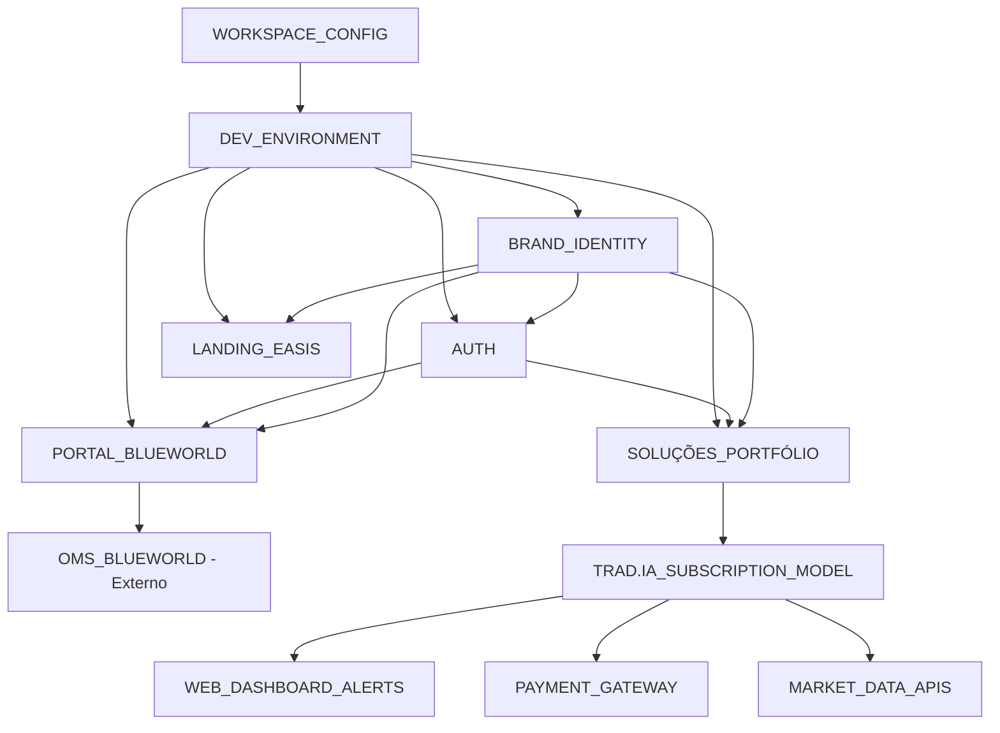

# CLAUDE.md - TOIT

**v1.6.0** | **Atualizado:** 2025-07-21 | **Mudança:** Modelo SaaS Trad.ia validado - análise completa de viabilidade

---

## 🎯 PROJETO
**Nome:** TOIT - The One in Tech  
**Status:** 60% | Monorepo estruturado + Modelo SaaS Trad.ia validado
**Stack:** Monorepo Turborepo + React/Node.js/PostgreSQL
**Deploy:** Railway (dev/qualidade/produção)
**Banco:** MySQL atual → PostgreSQL Railway-hosted
**Arquitetura:** Enterprise Monorepo (apps/, packages/, services/)
**Modelo de Negócio:** SaaS B2B/B2C com múltiplas soluções

---

## 📦 MÓDULOS

### MOD_001 - BRAND_IDENTITY
```yaml
Status: 🟢✅ Completo e operacional
Arquivos: Assets/escrito_main.html, logo interativo.html, logo interativo2.html, logo interativo3.html, toit_brand_assets.html, logos PNG
```
**Páginas:** /assets/* (recursos visuais)
**Funções:** displayBrand(), interactiveLogo(), brandShowcase()
**Endpoints:** N/A (estático)
**Tabelas:** N/A
**Regras:** RN_003 - Consistência visual obrigatória
**Depende:** Nenhum
**Usado por:** AUTH, PORTAL, LANDING
**Detalhes:** Sistema completo com 6+ variações de logo animadas, paleta de cores definida (#2563eb, #10b981, #f59e0b), tipografia (Inter + JetBrains Mono)

### MOD_002 - AUTHENTICATION
```yaml
Status: 🟡⚠️ Funcional básico (PHP temporário - CRÍTICO migrar)
Arquivos: login.html, login.php
```
**Páginas:** /login
**Funções:** login(), logout(), validateSession(), cpfMask()
**Endpoints:** POST /login.php, GET /logout
**Tabelas:** usuario (cpf, senha, perfil, clienteKey) - MySQL atual
**Regras:** RN_001 - Acesso obrigatório por CPF
**Depende:** Banco MySQL u527961246_TOIT
**Usado por:** PORTAL, DASHBOARD
**Detalhes:** Login com máscara CPF, redirecionamento por perfil (ADMIN/TOIT → principal, CLIENTE → blueworld), senha em texto plano (INSEGURO)

### MOD_003 - PORTAL_BLUEWORLD
```yaml
Status: 🟢✅ Interface completa e funcional
Arquivos: portal_blueworld_toit.html
```
**Páginas:** /portal/blueworld
**Funções:** displayDashboard(), showStatus(), openTicket(), quickAccess()
**Endpoints:** https://oms.blueworld.com.br (externo)
**Tabelas:** user_sessions (planejada)
**Regras:** RN_001 - Requer autenticação de CLIENTE
**Depende:** AUTH, BRAND_IDENTITY
**Usado por:** Clientes Blue World
**Detalhes:** Portal cliente com acesso ao OMS, status sistema, abertura de chamados, design responsivo com tema TOIT

### MOD_004 - LANDING_EASIS
```yaml
Status: 🟢✅ Landing page completa
Arquivos: easis_landing.html
```
**Páginas:** /easis
**Funções:** displayLanding(), submitLead(), contactForm()
**Endpoints:** POST /api/contact (planejado)
**Tabelas:** leads (planejada)
**Regras:** RN_002 - Captura de leads obrigatória
**Depende:** BRAND_IDENTITY
**Usado por:** Marketing, prospecção
**Detalhes:** Landing responsiva para produto Easis (ERP+CRM+Pagamentos), formulário lead, design moderno com gradientes

### MOD_005 - WORKSPACE_CONFIG
```yaml
Status: 🟢✅ Configuração completa
Arquivos: TOIT.code-workspace, WORKSPACE-CONFIG.md
```
**Páginas:** N/A (configuração)
**Funções:** setupWorkspace(), configureExtensions(), definesTasks()
**Endpoints:** N/A
**Tabelas:** N/A
**Regras:** RN_004 - Padronização desenvolvimento
**Depende:** VS Code/Cursor
**Usado por:** Equipe desenvolvimento
**Detalhes:** Configuração otimizada para Cursor AI, extensões recomendadas, tasks automatizadas, debug profiles

### MOD_006 - TRAD.IA_SUBSCRIPTION
```yaml
Status: 🟢✅ Modelo SaaS validado + estratégias viáveis identificadas
Arquivos: apps/trad-ia/backend/src/* (backtests + modelo negócio)
```
**Páginas:** /trad-ia (futuro dashboard assinantes)
**Funções:** signalGeneration(), riskManagement(), alertDelivery(), subscriptionManager()
**Endpoints:** /api/subscription/*, /api/signals/*, /api/alerts/*, /api/portfolio/*
**Tabelas:** subscriptions, signals, alerts, user_portfolios, trading_history
**Regras:** RN_005 - Gestão de risco + RN_006 - Modelo assinatura
**Depende:** AUTH, Payment Gateway, Market Data APIs
**Usado por:** Assinantes (R$50/mês), traders com R$25k+ capital
**Detalhes:** 
- **Estratégias Viáveis:** Swing Trading (43% a.a.), Pairs Trading (58% a.a.), Gap Trading
- **Alertas:** Dashboard web em tempo real com 75%+ confiança
- **Gestão Capital:** Kelly Criterion conservador (5% max), stop loss automático
- **Viabilidade:** Break-even com 500 assinantes, margem 30-60%

---

## 🔗 MAPA DE DEPENDÊNCIAS



---

## 🗄️ ESQUEMA DE DADOS

```sql
-- ATUAL (MySQL u527961246_TOIT)
MOD_002: usuario (id, cpf, senha, perfil, clienteKey)

-- PLANEJADO (PostgreSQL)
MOD_002: users, user_sessions, user_profiles
MOD_003: dashboard_widgets, user_preferences, support_tickets
MOD_004: leads, contact_forms, marketing_campaigns
MOD_005: system_logs, performance_metrics
MOD_006: trades, portfolio_stats, market_data, trading_sessions, signals, risk_events

-- Relacionamentos críticos
users --(1:N)--> user_sessions
users --(1:1)--> user_profiles
users --(1:N)--> support_tickets
users --(1:N)--> contact_forms
leads --(N:1)--> marketing_campaigns
```

---

## 📋 REGRAS DE NEGÓCIO GLOBAIS

### RN_001 - CONTROLE_ACESSO_CPF
**Módulos afetados:** AUTH, PORTAL_BLUEWORLD
**Implementação:** Login por CPF com redirecionamento por perfil
**Validação:** CPF válido + senha + perfil ativo
**Fluxo:** ADMIN/TOIT → /portal/principal.html | CLIENTE → /portal/blueworld/blueworld.html

### RN_002 - CAPTURA_LEADS_EASIS
**Módulos afetados:** LANDING_EASIS
**Implementação:** Formulário lead com validação client-side
**Validação:** Nome + Email + Empresa obrigatórios
**Ação:** Simulação de envio (desenvolvimento)

### RN_003 - CONSISTENCIA_VISUAL_TOIT
**Módulos afetados:** Todos os módulos visuais
**Implementação:** Paleta TOIT (#2563eb, #00eaff, #7c3aed) + fontes (Orbitron, Montserrat)
**Validação:** Todas as páginas seguem brand guidelines
**Assets:** Logo responsivo + animações + gradientes

### RN_004 - PADRONIZACAO_DESENVOLVIMENTO
**Módulos afetados:** Ambiente desenvolvimento
**Implementação:** Workspace configurado + extensões + tasks
**Validação:** Code formatting + ESLint + Prettier
**Deploy:** Railway com branches (dev/qualidade/main)

### RN_005 - GESTAO_RISCO_FINANCEIRO
**Módulos afetados:** SOLUÇÕES_PORTFÓLIO, TRAD.IA
**Implementação:** Kelly Criterion limitado 5% + Circuit breakers automáticos
**Validação:** Drawdown máximo 10% diário, 15% total + Stop-loss obrigatório 2x ATR
**Proteção:** Anti-Martingale conservador + filtros de liquidez + timing seguro

### RN_006 - MODELO_ASSINATURA_SAAS
**Módulos afetados:** TRAD.IA_SUBSCRIPTION
**Implementação:** Planos: Starter R$50, Professional R$150, Enterprise R$500
**Validação:** Sinais com 75%+ confiança + Capital mínimo R$25k recomendado
**Features:** Até 20 alertas/mês (Starter) + Dashboard web interativo + Gestão de capital
**Interface:** Login → Dashboard com sinais de entrada em tempo real + Stop loss/gain + Histórico
**SLA:** Alertas em tempo real no dashboard + Suporte por email + Análise detalhada

---

## 🚀 APIS CONSOLIDADAS

```yaml
# ATUAL (PHP)
/login.php:
  - POST: Autenticação CPF/senha → MySQL
  - Redirect: Por perfil (ADMIN/TOIT/CLIENTE)

# PLANEJADO (Node.js)
/api/auth:
  - POST /login: JWT auth + session
  - GET /logout: Invalidate token
  - GET /verify: Token validation
  - POST /refresh: Refresh token

/api/dashboard:
  - GET /blueworld: Cliente dashboard data
  - GET /admin: Admin dashboard data
  - POST /tickets: Criar chamado suporte

/api/contact:
  - POST /easis-lead: Captura lead Easis
  - GET /leads: Lista leads (admin)

# EXTERNOS
https://oms.blueworld.com.br: Sistema OMS (integração)
```

---

## ✅ EVOLUTION LOG

### v1.6.0 - 2025-07-21
**Mudanças:** Modelo SaaS Trad.ia validado com análise completa de viabilidade
**Módulos:** Trad.ia transformado em serviço de assinatura com alertas tempo real
**Impacto:** Modelo de negócio viável identificado - não day trade puro, mas swing/pairs trading
**Detalhes:** 
- Day trade puro inviável (backtests: -27% com R$10k, +0.16% com R$100k)
- Estratégias viáveis: Swing (43% a.a.), Pairs (58% a.a.), Gap Trading
- Break-even: 500 assinantes, margem 30-60%
- Dashboard web com sinais de entrada em tempo real
- Interface: Login → Tela com possíveis entradas + gestão de risco
**Próximo:** Implementar MVP com sistema de alertas + pagamentos

### v1.5.0 - 2025-07-21
**Mudanças:** Monorepo empresarial completo implementado + VS Code configurado
**Estrutura:** apps/ (portal, trad-ia) + packages/ (ui-components, design-system, auth-lib, utils) + services/
**Impacto:** Escalabilidade empresarial + desenvolvimento organizado + workspace otimizado
**Próximo:** Implementação backend modular + migração componentes React

### v1.4.0 - 2025-07-21
**Mudanças:** Sistema Trad.ia integrado + documentação completa das SOLUÇÕES
**Módulos:** 6 módulos documentados incluindo portfólio de soluções
**Impacto:** Ecossistema TOIT expandido com solução de trading IA
**Próximo:** Reorganização monorepo + implementação backend Trad.ia

### v1.3.0 - 2025-07-21
**Mudanças:** Contexto completo mapeado, todos arquivos analisados
**Módulos:** 5 módulos documentados + detalhes técnicos completos
**Impacto:** Base de conhecimento completa para desenvolvimento
**Próximo:** Análise SOLUCOES + integração sistemas

### v1.2.0 - 2025-07-18
**Mudanças:** Sistema claude init implementado, estrutura otimizada
**Módulos:** Sistema de documentação IA completo
**Impacto:** Continuidade perfeita entre sessões
**Próximo:** Análise completa do projeto

### v1.1.0 - 2025-07-18
**Mudanças:** Template modular implementado, análise de dependências
**Módulos:** Todos os módulos reestruturados
**Impacto:** Melhoria na organização e rastreabilidade
**Próximo:** Sistema de inicialização IA

### v1.0.0 - 2025-07-18
**Mudanças:** Workspace configurado, estrutura inicial
**Módulos:** BRAND_IDENTITY completo, AUTH básico
**Impacto:** Base sólida para desenvolvimento

---

## 🎯 ROADMAP

### 🚨 CRÍTICO (Sprint Atual)
- [ ] **TRAD.IA DASHBOARD**: Interface web com sinais em tempo real
- [ ] **PAYMENT GATEWAY**: Integração assinaturas (Stripe/PagSeguro)
- [ ] **SIGNAL ENGINE**: Motor de sinais com estratégias validadas
- [ ] **MIGRAÇÃO AUTH**: PHP → Node.js/JWT (segurança crítica)

### 📋 PRÓXIMO (Sprint +1)
- [ ] **API REST**: Endpoints completos (/auth, /dashboard, /contact)
- [ ] **SISTEMA TICKETS**: Funcionalidade "Abrir chamado" no portal
- [ ] **DASHBOARD ADMIN**: Interface para perfis ADMIN/TOIT
- [ ] **CAPTURA LEADS**: Backend para formulário Easis

### 🔮 FUTURO (Backlog)
- [ ] **FRONTEND REACT**: Migração HTML → React
- [ ] **SISTEMA WIDGETS**: Dashboard customizável
- [ ] **INTEGRAÇÃO OMS**: API bridge com https://oms.blueworld.com.br
- [ ] **MOBILE APP**: Versão mobile do portal
- [ ] **ANALYTICS**: Métricas de uso e performance

---

## 📊 MÉTRICAS DE PROJETO

**Complexidade:**
- Módulos: 6 (4 completos / 2 funcionais / 0 não iniciados)
- Apps: 2 (Portal, Trad.ia - estrutura monorepo)
- Packages: 4 (ui-components, design-system, auth-lib, utils)
- Páginas: 4 (4 implementadas / 0 planejadas)
- Arquivos: 30+ (incluindo backtests e análises)
- Endpoints: 1 atual (PHP) / 20+ planejados (incluindo Trad.ia APIs)
- Regras: 6 (6 documentadas / implementação variada)
- Modelo de Negócio: SaaS validado (Trad.ia R$50/mês)

**Qualidade:**
- Cobertura testes: 0%
- Bugs conhecidos: 0 funcionais / 1 segurança (senha texto plano)
- Débito técnico: **MUITO ALTO** (migração completa PHP → Node.js pendente)
- Identidade visual: **EXCELENTE** (6+ variações logo, paleta completa)

**Infraestrutura:**
- Deploy: Railway configurado (3 ambientes)
- Banco: MySQL funcional / PostgreSQL planejado
- Frontend: HTML5 responsivo completo
- Backend: **INEXISTENTE** (pasta vazia crítica)

---

## 🔥 CONTEXTO CRÍTICO

### Decisões Arquiteturais
- **PHP temporário**: APENAS para prototipação - CRÍTICO migrar
- **HTML estático**: Frontend funcional completo, React para v2.0
- **Railway deploy**: 3 ambientes (dev/qualidade/produção)
- **MySQL atual**: Funcional, PostgreSQL para escalabilidade

### Limitações CRÍTICAS
- **🚨 SEGURANÇA**: Senha em texto plano (login.php:29)
- **🚨 BACKEND**: Pasta Backend/ vazia - sem API
- **🚨 AUTENTICAÇÃO**: PHP não adequado para produção
- **⚠️ INTEGRAÇÃO**: OMS externo sem bridge API

### Alertas OBRIGATÓRIOS para IA
- **🚨 CRÍTICO**: NUNCA usar auth PHP atual em produção
- **🚨 CRÍTICO**: Backend/ vazio - implementação obrigatória antes deploy
- **🚨 CRÍTICO**: Senhas em texto plano - hash obrigatório
- **💎 POSITIVO**: Identidade visual EXCEPCIONAL - manter padrões
- **💎 POSITIVO**: Frontend responsivo completo - base sólida

---

## 💡 PROTOCOLO DE ATUALIZAÇÃO

### TRIGGERS OBRIGATÓRIOS:
1. **Mudança em arquivo** → Atualizar módulo afetado
2. **Nova funcionalidade** → Verificar dependências + regras
3. **Alteração BD** → Atualizar esquema + módulos relacionados
4. **Novo endpoint** → Atualizar APIs consolidadas
5. **Mudança regra negócio** → Verificar impacto global
6. **Bug crítico** → Adicionar ao contexto crítico

### ANÁLISE DE IMPACTO OBRIGATÓRIA:
```
ANTES de qualquer mudança:
1. Identificar módulos afetados
2. Verificar regras de negócio impactadas
3. Checar dependências quebradas
4. Validar integridade do sistema
5. Atualizar versão e log
```

---

**IMPORTANTE:** Este arquivo DEVE ser atualizado A CADA interação significativa. Nunca aguarde fim de sessão.
