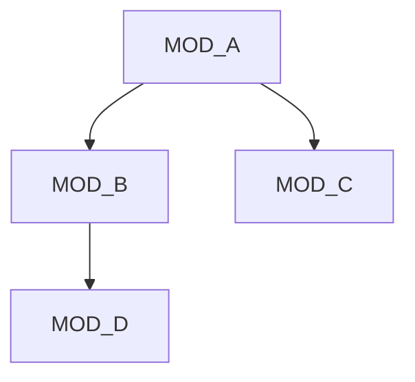

# CLAUDE TEMPLATE - Para Novos Projetos

## 🚀 COMO USAR ESTE TEMPLATE

### 1. Para Novo Projeto:
```bash
# Copie os arquivos para o novo projeto
cp claude-template.md novo-projeto/
cp claude-init.md novo-projeto/
```

### 2. Personalize:
- Renomeie `claude-template.md` para `claude-project.md`
- Substitua `[PLACEHOLDERS]` com informações reais
- Configure módulos específicos do projeto

### 3. Execute:
```bash
# Inicie uma sessão Claude
claude init
```

---

## 📄 TEMPLATE BASE

# CLAUDE.md - [NOME_PROJETO]

**v1.0.0** | **Atualizado:** [YYYY-MM-DD HH:MM] | **Mudança:** [PRIMEIRA_VERSÃO]

---

## 🎯 PROJETO
**Nome:** [NOME_COMPLETO_PROJETO]  
**Status:** [X]% | [FASE_ATUAL]  
**Stack:** [STACK_ATUAL] → [STACK_PLANEJADA]

---

## 📦 MÓDULOS

### MOD_001 - [NOME_MÓDULO]
```yaml
Status: [🟢✅|🟡⚠️|🔴❌] [DESCRIÇÃO_STATUS]
Arquivos: [lista_arquivos]
```
**Páginas:** [páginas_relacionadas]  
**Funções:** [funções_principais]  
**Endpoints:** [apis_relacionadas]  
**Tabelas:** [tabelas_bd]  
**Regras:** [regras_negocio_essenciais]  
**Depende:** [módulos_dependentes]  
**Usado por:** [módulos_que_usam]

### MOD_002 - [NOME_MÓDULO]
```yaml
Status: [🟢✅|🟡⚠️|🔴❌] [DESCRIÇÃO_STATUS]
Arquivos: [lista_arquivos]
```
**Páginas:** [páginas_relacionadas]  
**Funções:** [funções_principais]  
**Endpoints:** [apis_relacionadas]  
**Tabelas:** [tabelas_bd]  
**Regras:** [regras_negocio_essenciais]  
**Depende:** [módulos_dependentes]  
**Usado por:** [módulos_que_usam]

---

## 🔗 MAPA DE DEPENDÊNCIAS



---

## 🗄️ ESQUEMA DE DADOS

```sql
-- Tabelas por módulo
MOD_001: [tabela1, tabela2]
MOD_002: [tabela3, tabela4]

-- Relacionamentos críticos
[tabela1] --(FK)--> [tabela2]
[tabela3] --(FK)--> [tabela1]
```

---

## 📋 REGRAS DE NEGÓCIO GLOBAIS

### RN_001 - [NOME_REGRA]
**Módulos afetados:** [lista_módulos]  
**Implementação:** [onde_está_implementada]  
**Validação:** [como_validar]

### RN_002 - [NOME_REGRA]
**Módulos afetados:** [lista_módulos]  
**Implementação:** [onde_está_implementada]  
**Validação:** [como_validar]

---

## 🚀 APIS CONSOLIDADAS

```yaml
/api/[modulo]/[recurso]:
  - GET: [finalidade]
  - POST: [finalidade]
  - PUT: [finalidade]
  - DELETE: [finalidade]
```

---

## ✅ EVOLUTION LOG

### v1.0.0 - [YYYY-MM-DD]
**Mudanças:** [primeira_versão]  
**Módulos:** [módulos_iniciais]  
**Impacto:** [setup_inicial]  
**Próximo:** [próximas_ações]

---

## 🎯 ROADMAP

### AGORA (Sprint Atual)
- [ ] [tarefa_crítica_1]
- [ ] [tarefa_crítica_2]

### PRÓXIMO (Sprint +1)
- [ ] [tarefa_importante_1]
- [ ] [tarefa_importante_2]

### FUTURO (Backlog)
- [ ] [feature_futura_1]
- [ ] [feature_futura_2]

---

## 📊 MÉTRICAS DE PROJETO

**Complexidade:**
- Módulos: [X] ([completos]/[parciais]/[não iniciados])
- Tabelas: [X] ([implementadas]/[planejadas])
- Endpoints: [X] ([ativos]/[planejados])
- Regras: [X] ([implementadas]/[pendentes])

**Qualidade:**
- Cobertura testes: [X]%
- Bugs conhecidos: [X]
- Débito técnico: [ALTO|MÉDIO|BAIXO]

---

## 🔥 CONTEXTO CRÍTICO

### Decisões Arquiteturais
- [decisão_1]: [justificativa]
- [decisão_2]: [justificativa]

### Limitações Conhecidas
- [limitação_1]: [impacto]
- [limitação_2]: [impacto]

### Alertas para IA
- ⚠️ [alerta_crítico_1]
- ⚠️ [alerta_crítico_2]

---

## 💡 PROTOCOLO DE ATUALIZAÇÃO

### TRIGGERS OBRIGATÓRIOS:
1. **Mudança em arquivo** → Atualizar módulo afetado
2. **Nova funcionalidade** → Verificar dependências + regras
3. **Alteração BD** → Atualizar esquema + módulos relacionados
4. **Novo endpoint** → Atualizar APIs consolidadas
5. **Mudança regra negócio** → Verificar impacto global
6. **Bug crítico** → Adicionar ao contexto crítico

### ANÁLISE DE IMPACTO OBRIGATÓRIA:
```
ANTES de qualquer mudança:
1. Identificar módulos afetados
2. Verificar regras de negócio impactadas
3. Checar dependências quebradas
4. Validar integridade do sistema
5. Atualizar versão e log
```

---

**IMPORTANTE:** Este arquivo DEVE ser atualizado A CADA interação significativa. Nunca aguarde fim de sessão.