# 🔐 SISTEMA SSO - PORTAL TOIT

## 🎯 VISÃO GERAL

Sistema de **Single Sign-On (SSO)** centralizado onde usuários fazem login uma vez no Portal TOIT e acessam automaticamente todos os sistemas do ecossistema (OMS, Tradia, Easis ERP) sem nova autenticação.

---

## 🏗️ ARQUITETURA SSO

### 🔑 FLUXO DE AUTENTICAÇÃO

```mermaid
sequenceDiagram
    participant U as Usuário
    participant PT as Portal TOIT
    participant AUTH as Auth Service
    participant OMS as OMS Blue World
    participant TR as Trad.ia
    participant EA as Easis ERP

    U->>PT: Acessa blueworld.toit.com
    PT->>AUTH: Verificar sessão
    AUTH-->>PT: Não autenticado
    PT->>U: Página de Login
    U->>AUTH: Login (CPF + senha)
    AUTH->>AUTH: Validar credenciais
    AUTH->>AUTH: Gerar JWT + Session
    AUTH-->>PT: Token JWT + Cookie
    PT->>U: Dashboard com sistemas disponíveis
    U->>OMS: Clica "Acessar OMS"
    PT->>OMS: Redirect com token
    OMS->>AUTH: Validar token
    AUTH-->>OMS: Token válido + user context
    OMS->>U: Acesso direto (sem login)
```



### 🎫 ESTRUTURA DO JWT TOKEN

```typescript
interface ToitJWTPayload {
  // Identificação do usuário
  user_id: string;
  email: string;
  name: string;
  cpf?: string;
  
  // Contexto do tenant
  tenant: {
    id: string;
    slug: string;        // blueworld
    name: string;        // "Blue World Ltda"
    plan: string;        // BASIC, PREMIUM, ENTERPRISE
  };
  
  // Sistemas e permissões
  systems: {
    [systemCode: string]: {  // oms, tradia, easis
      system_id: string;
      role: string;          // ADMIN, USER, MANAGER
      permissions: string[]; // ['tickets.read', 'orders.create']
      expires_at?: string;   // Para trials
    };
  };
  
  // Metadados do token
  iat: number;    // Issued at
  exp: number;    // Expires at (8 horas)
  iss: string;    // "toit-auth"
  sub: string;    // user_id
  jti: string;    // JWT ID para revogação
  
  // Session info
  session_id: string;
  ip_address: string;
  user_agent: string;
}

// Exemplo de token para usuário Blue World
const exampleToken = {
  user_id: "uuid-123",
  email: "admin@blueworld.com.br",
  name: "João Silva",
  cpf: "123.456.789-00",
  tenant: {
    id: "uuid-tenant-bw",
    slug: "blueworld", 
    name: "Blue World Ltda",
    plan: "PREMIUM"
  },
  systems: {
    oms: {
      system_id: "uuid-sys-oms",
      role: "ADMIN",
      permissions: ["*"],  // Todas permissões
    },
    portal: {
      system_id: "uuid-sys-portal", 
      role: "USER",
      permissions: ["tickets.create", "tickets.read", "profile.update"]
    }
  },
  iat: 1642601600,
  exp: 1642630400,  // 8 horas
  iss: "toit-auth",
  sub: "uuid-123",
  jti: "uuid-jwt-456",
  session_id: "sess-789",
  ip_address: "192.168.1.100",
  user_agent: "Mozilla/5.0..."
};
```

---

## 🚀 IMPLEMENTAÇÃO DO AUTH SERVICE

### 🔧 CORE AUTH SERVICE

```typescript
// services/authService.ts
import jwt from 'jsonwebtoken';
import bcrypt from 'bcrypt';
import { Redis } from 'ioredis';

export class AuthService {
  private redis: Redis;
  private jwtSecret: string;
  private jwtRefreshSecret: string;
  
  constructor() {
    this.redis = new Redis(process.env.REDIS_URL);
    this.jwtSecret = process.env.JWT_SECRET;
    this.jwtRefreshSecret = process.env.JWT_REFRESH_SECRET;
  }
  
  // Login principal
  async login(credentials: {
    email?: string;
    cpf?: string;
    password: string;
    tenant_slug: string;
    ip_address: string;
    user_agent: string;
  }) {
    const { email, cpf, password, tenant_slug, ip_address, user_agent } = credentials;
    
    // 1. Encontrar tenant
    const tenant = await Tenant.findBySlug(tenant_slug);
    if (!tenant || tenant.status !== 'ACTIVE') {
      throw new Error('Tenant not found or inactive');
    }
    
    // 2. Encontrar usuário
    const user = await User.findOne({
      where: {
        tenant_id: tenant.id,
        ...(email && { email }),
        ...(cpf && { cpf }),
        status: 'ACTIVE'
      },
      include: ['roles']
    });
    
    if (!user || !await bcrypt.compare(password, user.password_hash)) {
      throw new Error('Invalid credentials');
    }
    
    // 3. Buscar sistemas e permissões do usuário
    const userSystems = await this.getUserSystems(user.id, tenant.id);
    
    // 4. Criar session
    const sessionId = generateUUID();
    await this.redis.setex(
      `session:${sessionId}`,
      8 * 60 * 60, // 8 horas
      JSON.stringify({
        user_id: user.id,
        tenant_id: tenant.id,
        created_at: new Date(),
        ip_address,
        user_agent
      })
    );
    
    // 5. Gerar tokens
    const jwtPayload: ToitJWTPayload = {
      user_id: user.id,
      email: user.email,
      name: user.name,
      cpf: user.cpf,
      tenant: {
        id: tenant.id,
        slug: tenant.slug,
        name: tenant.name,
        plan: tenant.plan
      },
      systems: userSystems,
      iat: Math.floor(Date.now() / 1000),
      exp: Math.floor(Date.now() / 1000) + (8 * 60 * 60), // 8h
      iss: 'toit-auth',
      sub: user.id,
      jti: generateUUID(),
      session_id: sessionId,
      ip_address,
      user_agent
    };
    
    const accessToken = jwt.sign(jwtPayload, this.jwtSecret);
    const refreshToken = jwt.sign(
      { user_id: user.id, session_id: sessionId },
      this.jwtRefreshSecret,
      { expiresIn: '30d' }
    );
    
    // 6. Salvar token para revogação
    await this.redis.setex(
      `token:${jwtPayload.jti}`,
      8 * 60 * 60,
      'active'
    );
    
    return {
      access_token: accessToken,
      refresh_token: refreshToken,
      expires_in: 8 * 60 * 60,
      user: {
        id: user.id,
        name: user.name,
        email: user.email,
        tenant: tenant.name
      },
      systems: Object.keys(userSystems)
    };
  }
  
  // Validar token (usado por todos os sistemas)
  async validateToken(token: string): Promise<ToitJWTPayload | null> {
    try {
      const payload = jwt.verify(token, this.jwtSecret) as ToitJWTPayload;
      
      // Verificar se token não foi revogado
      const tokenStatus = await this.redis.get(`token:${payload.jti}`);
      if (tokenStatus !== 'active') {
        return null;
      }
      
      // Verificar se session ainda existe
      const session = await this.redis.get(`session:${payload.session_id}`);
      if (!session) {
        return null;
      }
      
      return payload;
    } catch (error) {
      return null;
    }
  }
  
  // Logout (revoga token e session)
  async logout(token: string) {
    const payload = await this.validateToken(token);
    if (payload) {
      // Revogar token
      await this.redis.del(`token:${payload.jti}`);
      
      // Revogar session
      await this.redis.del(`session:${payload.session_id}`);
      
      // Log da ação
      await AuditLog.create({
        tenant_id: payload.tenant.id,
        user_id: payload.user_id,
        action: 'LOGOUT',
        ip_address: payload.ip_address
      });
    }
  }
  
  // Refresh token
  async refreshToken(refreshToken: string) {
    try {
      const payload = jwt.verify(refreshToken, this.jwtRefreshSecret) as any;
      
      // Verificar se session ainda existe
      const session = await this.redis.get(`session:${payload.session_id}`);
      if (!session) {
        throw new Error('Session expired');
      }
      
      // Gerar novo access token
      const user = await User.findById(payload.user_id);
      // ... (repetir lógica de login para gerar novo token)
      
    } catch (error) {
      throw new Error('Invalid refresh token');
    }
  }
  
  private async getUserSystems(userId: string, tenantId: string) {
    const userRoles = await UserRole.find({
      where: { user_id: userId, tenant_id: tenantId },
      include: ['system']
    });
    
    const systems = {};
    for (const role of userRoles) {
      systems[role.system.code] = {
        system_id: role.system_id,
        role: role.role,
        permissions: role.permissions,
        expires_at: role.expires_at
      };
    }
    
    return systems;
  }
}
```

### 🌐 MIDDLEWARE SSO UNIVERSAL

```typescript
// middleware/ssoMiddleware.ts
export const ssoMiddleware = (systemCode: string) => {
  return async (req: Request, res: Response, next: NextFunction) => {
    let token: string | null = null;
    
    // 1. Tentar buscar token do header Authorization
    const authHeader = req.headers.authorization;
    if (authHeader && authHeader.startsWith('Bearer ')) {
      token = authHeader.substring(7);
    }
    
    // 2. Tentar buscar token do cookie (para navegador)
    if (!token && req.cookies['toit_access_token']) {
      token = req.cookies['toit_access_token'];
    }
    
    // 3. Tentar buscar token da query string (para redirect SSO)
    if (!token && req.query.token) {
      token = req.query.token as string;
    }
    
    if (!token) {
      return res.status(401).json({ error: 'No token provided' });
    }
    
    // Validar token
    const authService = new AuthService();
    const payload = await authService.validateToken(token);
    
    if (!payload) {
      return res.status(401).json({ error: 'Invalid or expired token' });
    }
    
    // Verificar se usuário tem acesso a este sistema
    const systemAccess = payload.systems[systemCode];
    if (!systemAccess) {
      return res.status(403).json({ 
        error: `No access to system: ${systemCode}` 
      });
    }
    
    // Adicionar contexto ao request
    req.user = {
      id: payload.user_id,
      name: payload.name,
      email: payload.email,
      cpf: payload.cpf,
      role: systemAccess.role,
      permissions: systemAccess.permissions
    };
    
    req.tenant = payload.tenant;
    req.system = systemAccess;
    req.session = {
      id: payload.session_id,
      ip_address: payload.ip_address,
      expires_at: new Date(payload.exp * 1000)
    };
    
    next();
  };
};

// Uso específico em cada sistema
// OMS Blue World
app.use('/api', ssoMiddleware('oms'));

// Trad.ia  
app.use('/api', ssoMiddleware('tradia'));

// Portal TOIT
app.use('/api', ssoMiddleware('portal'));
```

---

## 🖥️ FRONTEND SSO INTEGRATION

### 🔑 AUTH CONTEXT

```tsx
// contexts/AuthContext.tsx
interface AuthContextType {
  user: User | null;
  tenant: Tenant | null;
  systems: string[];
  login: (credentials: LoginCredentials) => Promise<void>;
  logout: () => Promise<void>;
  hasPermission: (system: string, permission: string) => boolean;
  isAuthenticated: boolean;
}

export const AuthProvider = ({ children }) => {
  const [user, setUser] = useState<User | null>(null);
  const [tenant, setTenant] = useState<Tenant | null>(null);
  const [systems, setSystems] = useState<string[]>([]);
  const [loading, setLoading] = useState(true);
  
  // Verificar token ao carregar app
  useEffect(() => {
    const checkAuth = async () => {
      const token = Cookies.get('toit_access_token');
      if (token) {
        try {
          const response = await api.get('/auth/me', {
            headers: { Authorization: `Bearer ${token}` }
          });
          
          setUser(response.data.user);
          setTenant(response.data.tenant);
          setSystems(response.data.systems);
        } catch (error) {
          // Token inválido, limpar
          Cookies.remove('toit_access_token');
          Cookies.remove('toit_refresh_token');
        }
      }
      setLoading(false);
    };
    
    checkAuth();
  }, []);
  
  const login = async (credentials: LoginCredentials) => {
    const response = await api.post('/auth/login', credentials);
    const { access_token, refresh_token, user, systems } = response.data;
    
    // Salvar tokens
    Cookies.set('toit_access_token', access_token, { 
      expires: 1/3, // 8 horas
      secure: true,
      httpOnly: false  // Precisa ser acessível pelo JS para APIs
    });
    
    Cookies.set('toit_refresh_token', refresh_token, { 
      expires: 30,  // 30 dias
      secure: true,
      httpOnly: true
    });
    
    setUser(user);
    setSystems(systems);
  };
  
  const logout = async () => {
    const token = Cookies.get('toit_access_token');
    if (token) {
      await api.post('/auth/logout', {}, {
        headers: { Authorization: `Bearer ${token}` }
      });
    }
    
    // Limpar estado e cookies
    setUser(null);
    setTenant(null);
    setSystems([]);
    Cookies.remove('toit_access_token');
    Cookies.remove('toit_refresh_token');
    
    // Redirect para login
    window.location.href = '/login';
  };
  
  const hasPermission = (system: string, permission: string): boolean => {
    if (!user || !systems.includes(system)) return false;
    
    // Implementar lógica de verificação de permissões
    // Pode ser feita no backend via token decode também
    return true;
  };
  
  return (
    <AuthContext.Provider value={{
      user,
      tenant, 
      systems,
      login,
      logout,
      hasPermission,
      isAuthenticated: !!user
    }}>
      {loading ? <LoadingScreen /> : children}
    </AuthContext.Provider>
  );
};
```

### 🌐 SISTEMA DE NAVEGAÇÃO SSO

```tsx
// components/SystemNavigation.tsx
export const SystemNavigation = () => {
  const { systems, tenant } = useAuth();
  const [availableSystems, setAvailableSystems] = useState([]);
  
  useEffect(() => {
    const fetchSystems = async () => {
      const response = await api.get('/systems/available');
      setAvailableSystems(response.data);
    };
    fetchSystems();
  }, [systems]);
  
  const handleSystemAccess = (systemCode: string) => {
    const token = Cookies.get('toit_access_token');
    const systemUrls = {
      oms: `https://${tenant.slug}-oms.toit.com`,
      tradia: `https://${tenant.slug}-tradia.toit.com`, 
      easis: `https://${tenant.slug}-easis.toit.com`
    };
    
    // Redirect com token para SSO automático
    window.open(`${systemUrls[systemCode]}?token=${token}`, '_blank');
  };
  
  return (
    <div className="systems-grid">
      {availableSystems.map(system => (
        <SystemCard
          key={system.code}
          system={system}
          hasAccess={systems.includes(system.code)}
          onClick={() => handleSystemAccess(system.code)}
        />
      ))}
    </div>
  );
};
```

---

## 🔄 INTEGRAÇÃO COM OMS BLUE WORLD

### 🏗️ MIGRAÇÃO DO OMS ATUAL

```typescript
// migration/migrateOmsAuth.ts
export const migrateOmsToSSO = async () => {
  // 1. Criar tenant Blue World no sistema unificado
  const tenant = await Tenant.create({
    slug: 'blueworld',
    name: 'Blue World Ltda',
    status: 'ACTIVE',
    plan: 'PREMIUM'
  });
  
  // 2. Registrar sistema OMS
  const omsSystem = await ToitSystem.create({
    code: 'oms',
    name: 'OMS Blue World',
    description: 'Sistema de Gestão de Ordens de Serviço'
  });
  
  // 3. Associar tenant ao sistema
  await TenantSystem.create({
    tenant_id: tenant.id,
    system_id: omsSystem.id,
    status: 'ACTIVE'
  });
  
  // 4. Migrar usuários existentes
  const omsUsers = await getOmsUsers(); // Do banco OMS atual
  
  for (const omsUser of omsUsers) {
    // Criar usuário no sistema unificado
    const user = await User.create({
      tenant_id: tenant.id,
      email: omsUser.email,
      cpf: omsUser.cpf,
      password_hash: omsUser.password_hash, // Manter hash atual
      name: omsUser.nome,
      phone: omsUser.telefone,
      status: 'ACTIVE'
    });
    
    // Definir role baseado no perfil OMS atual
    const role = omsUser.tipo === 'ADMIN' ? 'ADMIN' : 'USER';
    const permissions = omsUser.tipo === 'ADMIN' ? ['*'] : [
      'orders.read', 'orders.create', 'orders.update',
      'tickets.create', 'tickets.read'
    ];
    
    await UserRole.create({
      user_id: user.id,
      tenant_id: tenant.id,
      system_id: omsSystem.id,
      role,
      permissions
    });
  }
};
```

### 🔧 ADAPTAÇÃO DO OMS PARA SSO

```typescript
// oms/middleware/authMiddleware.ts
export const omsAuthMiddleware = ssoMiddleware('oms');

// oms/routes/index.ts
import { omsAuthMiddleware } from '../middleware/authMiddleware';

// Aplicar SSO em todas rotas da API
app.use('/api', omsAuthMiddleware);

// Endpoint para receber redirect SSO
app.get('/sso-callback', (req: Request, res: Response) => {
  const { token } = req.query;
  
  if (token) {
    // Salvar token em cookie e redirect para dashboard
    res.cookie('toit_access_token', token, {
      httpOnly: false,
      secure: true,
      maxAge: 8 * 60 * 60 * 1000 // 8 horas
    });
    
    res.redirect('/dashboard');
  } else {
    res.redirect('/login');
  }
});

// Página de login redirecta para Portal TOIT
app.get('/login', (req: Request, res: Response) => {
  const returnUrl = encodeURIComponent(`${req.protocol}://${req.get('host')}/sso-callback`);
  res.redirect(`https://blueworld.toit.com/login?returnUrl=${returnUrl}`);
});
```

---

## 📊 DASHBOARD DE ADMINISTRAÇÃO SSO

### 🛠️ ADMIN TOIT - GESTÃO DE SESSIONS

```tsx
// admin/components/SessionManager.tsx
export const SessionManager = () => {
  const [activeSessions, setActiveSessions] = useState([]);
  
  useEffect(() => {
    const fetchSessions = async () => {
      const response = await api.get('/admin/sessions/active');
      setActiveSessions(response.data);
    };
    
    fetchSessions();
    
    // Atualizar a cada 30 segundos
    const interval = setInterval(fetchSessions, 30000);
    return () => clearInterval(interval);
  }, []);
  
  const revokeSession = async (sessionId: string) => {
    await api.delete(`/admin/sessions/${sessionId}`);
    // Atualizar lista
    setActiveSessions(prev => prev.filter(s => s.id !== sessionId));
  };
  
  return (
    <div className="session-manager">
      <h3>Sessões Ativas</h3>
      <table>
        <thead>
          <tr>
            <th>Usuário</th>
            <th>Tenant</th>
            <th>Sistemas</th>
            <th>IP</th>
            <th>Início</th>
            <th>Último Acesso</th>
            <th>Ações</th>
          </tr>
        </thead>
        <tbody>
          {activeSessions.map(session => (
            <tr key={session.id}>
              <td>{session.user.name}</td>
              <td>{session.tenant.name}</td>
              <td>{session.systems.join(', ')}</td>
              <td>{session.ip_address}</td>
              <td>{formatDate(session.created_at)}</td>
              <td>{formatDate(session.last_activity)}</td>
              <td>
                <button 
                  onClick={() => revokeSession(session.id)}
                  className="btn btn-danger btn-sm"
                >
                  Revogar
                </button>
              </td>
            </tr>
          ))}
        </tbody>
      </table>
    </div>
  );
};
```

---

## ✅ BENEFÍCIOS DO SSO TOIT

### 🚀 **EXPERIÊNCIA DO USUÁRIO**
- Login único para todos os sistemas
- Navegação fluida entre aplicações  
- Session management centralizado
- Logout centralizado

### 🔒 **SEGURANÇA**
- Tokens JWT seguros com contexto
- Revogação centralizada de sessões
- Auditoria completa de acessos
- Permissões granulares por sistema

### 🛠️ **OPERACIONAL**
- Gestão centralizada de usuários
- Onboarding simplificado
- Monitoring de sessões ativas
- Troubleshooting facilitado

### 📈 **ESCALABILIDADE**
- Novos sistemas integram facilmente
- Tenant isolation mantido
- Performance otimizada
- Multi-device support

---

*Sistema SSO centralizado permitirá que Blue World e futuros clientes tenham experiência unificada em todo ecossistema TOIT.*